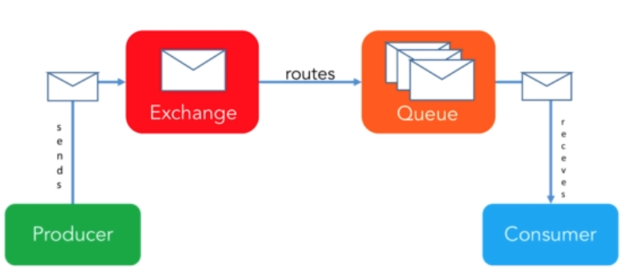
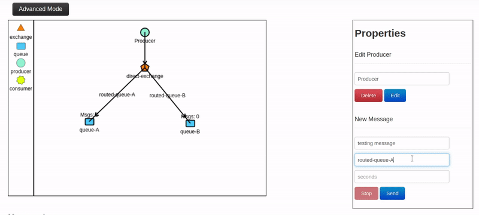
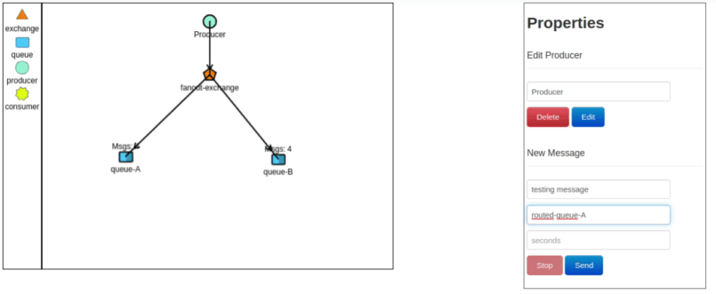

# Learning Rabbit MQ 

RabbitMQ is a message queuing software. It is a way of exchanging data between processes, applications and servers in asyncronous communication. 

RabbitMQ is one of the most widely used message brokers and implements AMPQ.

    AMQP = Advanced Message Queueing Protocol


### Rabbit MQ on docker

To run rabbit MQ, we can run the next docker command:
```
$ docker run -d --hostname localhost --name local-rabbit -p 15672:15672 -p 5672:5672 rabbitmq:3-management
```
Before the first start, we can stop and start the docker with the command `docker stop local-rabbit` and `docker start local-rabbit`

## How it works



- Message: Data sent from producer to consumer through RabbitMQ
- Producer: Application that sends the messages
- Exchange: Receives messages from producers and pushes them to queues depending on rules defined by the exchange type. A queue needs to be bound to at least one exchange to be able to receive messages.
- Queue: Buffer that stores messages
- Consumer: Application that receives the messages

#### Other elements
- Connection: TCP connection between the application and the RabbitMQ
broker
- Channel: A virtual connection inside a connection. When publishing or consuming messages or subscribing to a queue, it’s all done over a channel. 
- Binding: Link between a queue and an exchange
- Routing Key: The key that the exchange looks at to decide how to route the message to queues. Think of the routing key as the destination address of a message.

### Virtual Hosts

It’s possible to connect to RabbitMQ with a given username and password, with assigned permissions such as rights to read, write and configure. Users can also be assigned permissions to specific **virtual hosts**.

Virtual host or Vhost segregate applications that are using the same RabbitMQ instance. Different users can have different access privileges to different vhosts and queues, and exchanges can be created so that they only exist in one vhost. The same of different databases in a Database Server.

Isolate users, exchanges, queues, etc. to one specific vhost or separate environments, e.g., production, to one vhost and staging to another vhost within the same broker instead of setting up multiple brokers. The downside of using a single instance is that there is no resource isolation between vhosts. 

### Exchanges

Messages are not published directly to a queue. Instead, the producer sends messages to an exchange. Exchanges takes a message and routes it into one or more queues. The Routing algorithm decides where to send messages from exchange and depends on the exchange type and rules, the bindings.

Exchange can be configure as Durable -if not, it will be deleted at restart-, auto-deleted -if true, removed when last bound object is unbound, and internal -if true, only an other exchange can post in-. We have four types of exchanges:

- **Direct** - A direct exchange delivers messages to queues based on a message routing key. In a direct exchange, the message is routed to the queue with the exact match of binding key as the routing key of the message. For example, if the queue is bound to the exchange using the binding key ‘pdfprocess’, a message published to the exchange with a routing key ‘pdfprocess’ is routed to that queue.



- **Topic** - The topic exchange performs a wildcard match between the routing key and the routing pattern specified in the binding.
- **Fanout** - A fanout exchange routes messages to all of the queues that are bound to it.



- **headers**- A Header exchange uses the headers of the messages to route for binding queues. I never see this kind of exchange

#### Default exchange
The default exchange is a pre-declared direct exchange with no name, usually referred to with the empty string, “”. When using the default exchange, the message is delivered to the queue with a name equal to the routing key of the message. Every queue is automatically bound to the default exchange with a routing key that matches the queue name.

#### Dead Letter exchange

The broker will not return an error, and silently dropping the messages published to a queue that hasn’t been declared or to an exchange with a routing key that doesn’t match any existing queues. RabbitMQ provides an AMQP extension known as the Dead Letter Exchange, which provides functionality to capture messages that are not deliverable

### Queues

They are the final destination of messages on Rabbit. Consumers only know about queues and don't know about the exchange or anything else.
Some properties:
- Durable: If queue is persist or not. If true, ensures that RabbitMQ never loses the queue.
- Auto-delete: If yes, the queue will delete itself after at least one consumer has connected, and then all consumers have disconnected.
- Message TTL: The time a message published to a queue can live before being discarded (milliseconds).
- Auto-expire: The time a queue can be unused before it is automatically deleted (milliseconds). It can have itens, but if no one is connected, will be deleted
- Max length: How many ready messages a queue can hold before it starts to drop them, starting by the oldests or rejecting the new message depending of the _queue overflow behaviour_ configuration.

Existing a few more properties, so you can read the documentation.

If a message cannot be routed to any queue (no exist a binding) may can lost the message depending the attributes set on publish.

### Sending a message
There is a choice of libraries for all major programming languages and follow the next steps to send a message:
1. We need to set up/create a connection object. Here, the username, password, connection URL, port, etc., are specified. A TCP connection will be set up between the application and RabbitMQ.
2. A channel needs to be opened using the connection interface. You are now ready to send and receive messages.
3. Declare/create a queue. Declaring a queue will cause it to be created if it does not already exist. 
4. Set up exchanges and bind a queue to an exchange. Messages are only routed to a queue if the queue is bound to an exchange.
5. Publish a message to an exchange and consume a message from the queue.
6. Close the channel and the connection

## Performance

Some applications require high throughput while other applications are publishing batch jobs that can be delayed for a while. Tradeoffs must be accepted between performance and guaranteed message delivery. The goal when designing the system should be to maximize combinations of performance and availability that make sense for the specific application. Bad architectural design decisions and client-side bugs can damage the broker or affect throughput.

### Queue optimization: Keep queues short
- Short queues are fastest. A message published to an empty queue will go straight out to the consumer as soon as the queue receives it (a persistent message in a durable queue will go to disk). **The recommendation isto keep fewer than 10,000 messages in one queue**
- Many messages in a queue can put a heavy load on RAM usage. In order to free up RAM, RabbitMQ starts flushing (page out) messages to disk. 
- It is time-consuming to restart a cluster with many messages because the index must be rebuilt. It takes time to sync messages between nodes in the cluster after a restart.
- Enable lazy queues to get predictable performance:  It provides a more predictable, smooth performance without any sudden drops, but at the cost. Messages are only loaded into memory when needed, thereby minimizing the RAM usage, but increasing the throughput time. Is recommended if you are sending many messages at once or if exists the risk of consumers can not keep speed.
-  Disable lazy queues if high performance is required, if queues are always short, or if a max-length policy exists. Use TTL too descarting the head messages.

### Cluster: Number of queues

- Queues are single-threaded in RabbitMQ, with one queue able to handle up to about 50,000 messages. Optimal throughput is achieved with as many queues as cores on the underlying node(s).
- The RabbitMQ management interface collects and calculates metrics for every queue in the cluster. This might slow down the server if there are thousands upon thousands of active queues and consumers.
- Two plugins that help if there are multiple nodes or a single node cluster with multiple cores are the consistent hash exchange plugin and RabbitMQ Sharding
- Auto-delete unused queues: A TTL policy will delete queues that have not had messages consumed in a certain time, and auto-delete queue, which is deleted when its last consumer has canceled or channel/connection is close

### Other Queues points
- Set limited use on priority queues: Queues can have zero or more priority levels, but each level use an internal queue, that means that it takes resources.
- Payload Message Size and Type

### Connections
- Don’t use too many connections or channels,. In a worst case scenario, the server can crash due to running out of memory
- Don’t open and close connections or channels repeatedly, doing that means a higher latency, as more TCP packages have to be sent and received.
- For the highest throughput, separate connections for publisher and consumer

### Acknowledgments and confirms
- The client can either ack(knowledge) the message when it receives it, or when the client has completely processed the message. Acknowledgment has a performance impact.
- Publish confirm is the same; the server acks when it has received a message from a publisher. Publish confirm also has a performance impact
- All unacknowledged messages must reside in RAM on the servers. An efficient way to limit unacknowledged messages is to limit how many messages the clients pre-fetch

### Persistent message and durable queues
- To ensure that messages and broker definitions survive restarts, ensure that they are on disk: Queues should be declared as “durable” and messages should be sent with delivery mode “persistent”.
- Persistent messages are heavier as they have to be written to disk. Similarly, lazy queues have the same effect on performance
- The pre-fetch value is used to specify how many messages are consumed at the same time. It is used to get as much out of the consumers as possible.

## References:
- https://www.cloudamqp.com/docs/index.html
- http://tryrabbitmq.com/
- https://www.udemy.com/course/learn-rabbitmq-asynchronous-messaging-with-java-and-spring/